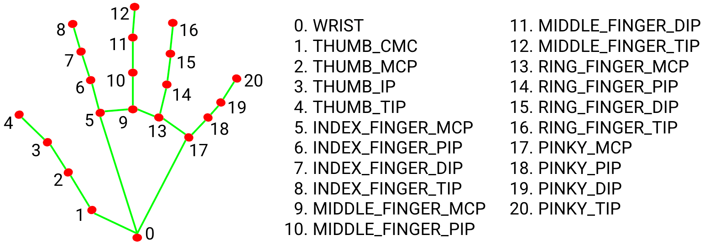

# HCI-control_by_hand
## Functions
### 1. Capture photo by your camera and analysis hand in the photo.

The function depends on [MediaPipe(Very Useful!)](https://google.github.io/mediapipe/)!

Red points are the key points of your hand;

Blue point is the center point to control your mouse.

### 2. Move your mouse by your hand.

### 3. Use special gesture to simulate DOWN/UP action on your LEFT key.

### 4. Use special gesture to simulate DOWN/UP action on your RIGHT key.

### 5. Use special gesture to enter or leave DRAW MODE. In this mode, you can draw something. The application will tell it as Rectangle, Triangle or Circle!

## Methods
### Use TCP to connect between processes.
For the limit of the course, I have to use C++ to complete this project.

However, I can not find any available version of MediaPipe in C++. Instead, it is in python.

Finally, I run my main application in C++, which will start another python process.

The C++ process capture photo using opencv and send picture to python process, then the python process send back the analysis result from MediaPipe.

The system works well, with FPS about 25(primarily limited by camera) and latency about 50ms. 

### Use Evolutionary algorithms to tell the shape of the trajectory points.

This part is very complex(in my opinion).

In short, I use CSO(competitive swarm optimization, created by professor Ran Cheng) to find the best shape arguments to fit the points set.

Transform the problem be an optimization problem.

For Rectangle, it is in 4-D, with the p_x, p_y of the position, and the height and width.

For Triangle, it is in 6-D, with p_x, p_y of each end points.

For Circle, it is in 3-D, with p_x, p_y of the center and the radius.

Given the whole shape parameters, we can easily calculate the sum of the distance between each point and the shape.

Treat the distance sum as fitness, use evolutionary algorithms to find the solution. 
## That's all. Thanks